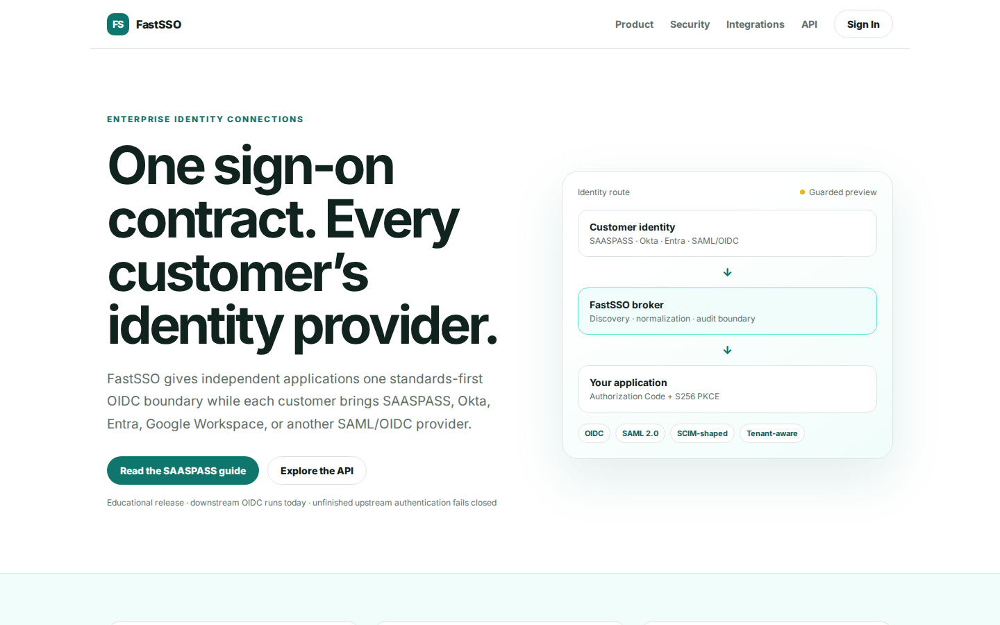
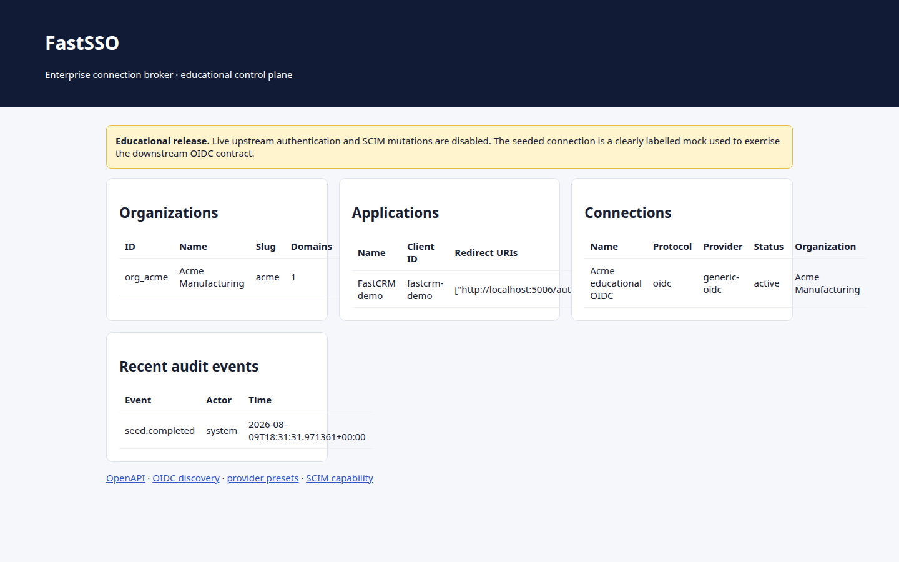
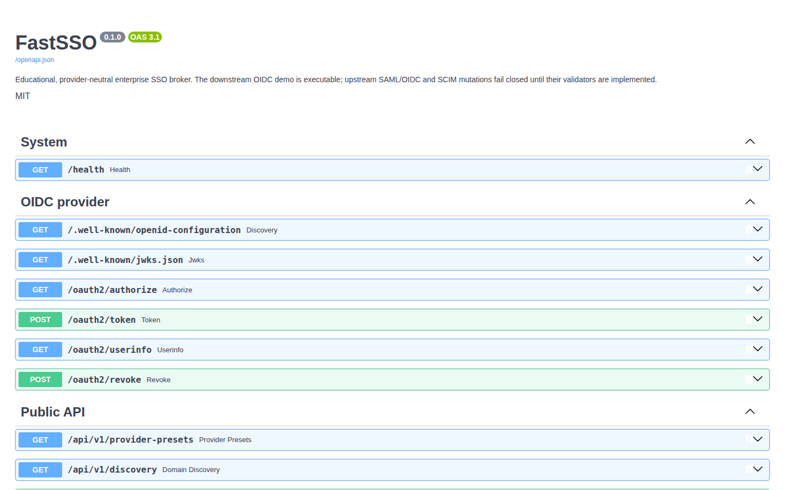
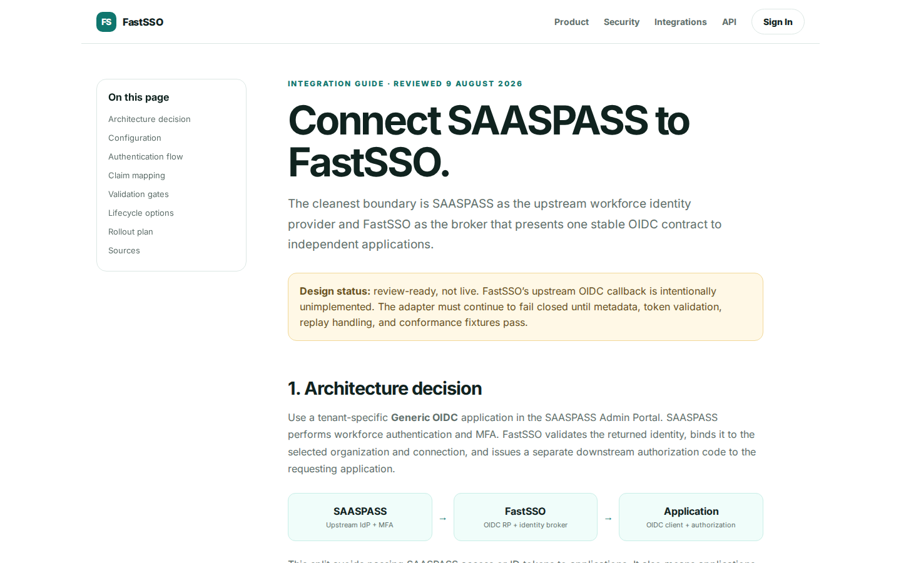

# FastSSO Platform Guide

**Published:** 2026-08-19
**Platform:** [https://sso.fastsme.com](https://sso.fastsme.com)
**Source:** [github.com/predictivelabsai/FastSSO](https://github.com/predictivelabsai/FastSSO)

## Platform overview

FastSSO is an open-source, self-hostable **enterprise SSO integration broker**. An application integrates once through OpenID Connect (OIDC) or the small REST API, while each customer organization can bring a SAML 2.0 or OIDC identity provider.

This visual guide was reviewed against the live product using Playwright. Screens and available navigation can vary by account, role, and deployment configuration.

## 1. One sign-on contract. Every customer’s identity provider.

ENTERPRISE IDENTITY CONNECTIONS One sign-on contract. Every customer’s identity provider. FastSSO gives independent applications one standards-first OIDC boundary while each customer brings SAASPASS, Okta, Entra, Google Workspace, or another SAML/OIDC provider

Screen reviewed at: [https://sso.fastsme.com/](https://sso.fastsme.com/)

## 2. FastSSO

Educational release. Live upstream authentication and SCIM mutations are disabled. The seeded connection is a clearly labelled mock used to exercise the downstream OIDC contract. Organizations ID Name Slug Domains Connections org_acme Acme Manufacturing acme 1

Screen reviewed at: [https://sso.fastsme.com/admin](https://sso.fastsme.com/admin)

## 3. FastSSO 0.1.0 OAS 3.1

System GET /health Health OIDC provider GET /.well-known/openid-configuration Discovery GET /.well-known/jwks.json Jwks GET /oauth2/authorize Authorize POST /oauth2/token Token GET /oauth2/userinfo Userinfo POST /oauth2/revoke Revoke Public API GET /api/v1/pro

Screen reviewed at: [https://sso.fastsme.com/docs](https://sso.fastsme.com/docs)

## 4. Connect SAASPASS to FastSSO.

On this page Architecture decision Configuration Authentication flow Claim mapping Validation gates Lifecycle options Rollout plan Sources INTEGRATION GUIDE · REVIEWED 9 AUGUST 2026 Connect SAASPASS to FastSSO. The cleanest boundary is SAASPASS as the upstream

Screen reviewed at: [https://sso.fastsme.com/integrations/saaspass](https://sso.fastsme.com/integrations/saaspass)

## Getting started

Visit [https://sso.fastsme.com](https://sso.fastsme.com) to explore FastSSO. For source code and deployment details, use the GitHub link above.
